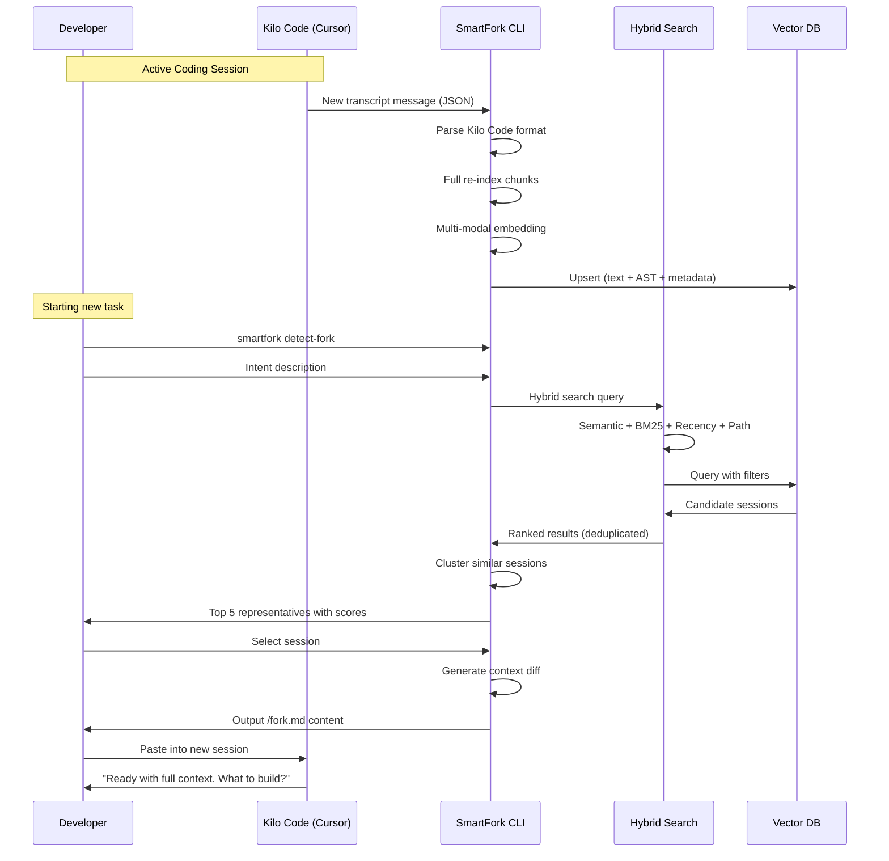
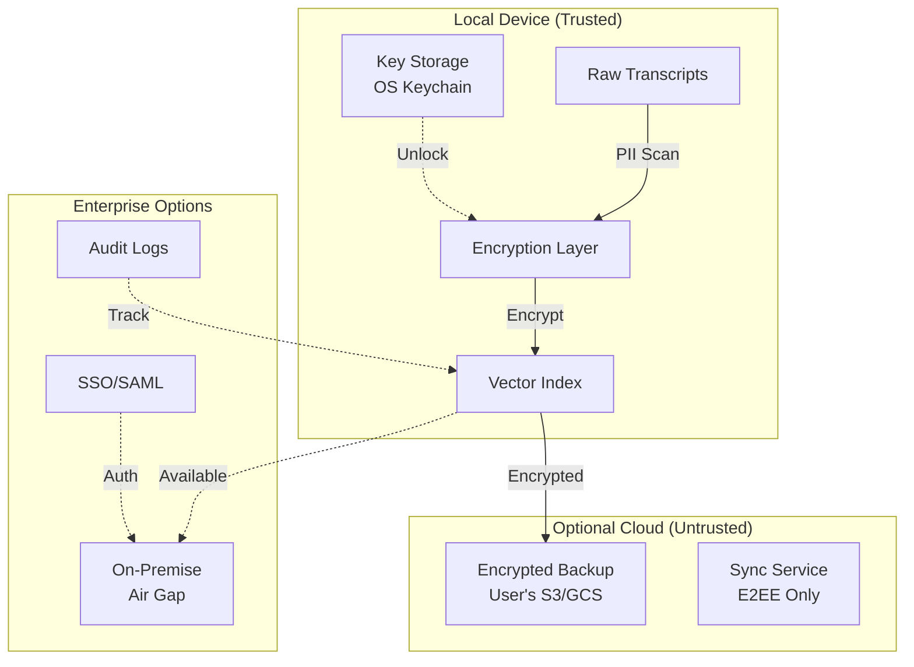

# SmartFork - Enhanced Architecture (v2.0)

## Executive Summary

SmartFork is an AI-native developer productivity system with **hybrid search intelligence**, **offline-first architecture**, and **multi-IDE support**. This enhanced plan incorporates 20 critical improvements over the original design.

**Key Decisions:**
- **Target Platform**: Kilo Code extension within Cursor IDE (Windows)
- **Transcript Source**: `C:/Users/amans/AppData/Roaming/Cursor/User/globalStorage/kilocode.kilo-code/tasks/`
- **Phase 0 Strategy**: Full re-index approach (incremental indexing after core features stable)
- **Delivery**: CLI-first tool with Python 3.13
- **Dependencies**: Simple requirements.txt (no Poetry/complex build system)

---

## Core Value Proposition

> **"Don't let that valuable context go to waste."**

Every developer accumulates hundreds of hours of invaluable context. SmartFork transforms this into a permanent, searchable, forkable asset with intelligent relevance scoring, privacy-first design, and team collaboration features.

---

## System Architecture

```mermaid
flowchart TB
    subgraph Input["Multi-Source Sessions"]
        KILO[Kilo Code<br/>Primary Target]
        CC[Claude Code<br/>Future Support]
        CUR[Cursor IDE<br/>Native]
        COP[GitHub Copilot<br/>Future]
        GIT[Git History<br/>Enrichment]
    end

    subgraph Processing["SmartFork Intelligence Layer"]
        TW[Transcript Watcher<br/>Incremental Indexing]
        HS[Hybrid Search Engine]
        subgraph SearchComponents["Hybrid Search Components"]
            SEM[Semantic<br/>nomic-embed-text-v1.5]
            KEY[Keyword<br/>BM25]
            REC[Recency<br/>Weighting]
            PROJ[Project Path<br/>Matching]
        end
        ST[Smart Titles<br/>Real-time Generation]
        MM[Multi-Modal<br/>AST + Errors + Git]
    end

    subgraph Storage["Privacy-First Storage"]
        DB[(ChromaDB Local)]
        META[(Metadata +<br/>Knowledge Graph)]
        VAULT[(Privacy Vault<br/>E2EE)]
    end

    subgraph Intelligence["Advanced Features"]
        DF[/detect-fork<br/>Proactive Suggestions]
        FM[/fork.md<br/>Context Diff]
        CT[Conversation Tree<br/>Branching View]
        DEDUP[Semantic<br/>Deduplication]
    end

    subgraph Output["Developer Experience"]
        CLI[CLI Interface]
        DASH[Metrics Dashboard]
        PLUG[Plugin<br/>Ecosystem]
    end

    KILO & CC & CUR & COP & GIT -->|Session Files| TW
    TW -->|Chunks| MM
    MM -->|Embeddings| SEM
    SEM & KEY & REC & PROJ -->|Combined Score| HS
    HS -->|Vectors| DB
    DB -->|Metadata| META
    META -->|Enrichment| DEDUP
    DEDUP -->|Clusters| DF
    DF -->|Results| CLI
    CLI -->|Fork| FM
    FM -->|Context Diff| CT
    VAULT -.->|Private Sessions| DB
    DASH -.->|Analytics| CLI
    PLUG -.->|Extensions| HS
```

---

## Key Improvements Over Original Design

### 1. Hybrid Search Strategy (vs Pure Semantic)

| Component | Weight | Description |
|-----------|--------|-------------|
| Semantic Similarity | 50% | nomic-embed-text-v1.5 (8,192 token window) |
| BM25 Keyword | 25% | Specific term matching for code/tech terms |
| Recency Weighting | 15% | More recent sessions rank higher |
| Project Path Match | 10% | Same directory = relevance boost |

**Why**: Pure semantic search misses exact matches for specific error messages or function names.

### 2. Indexing Strategy (Phase 0: Full Re-Index)

**Phase 0 Approach**: Full re-index for simplicity and reliability
```python
# Phase 0: Full re-index - process entire session each time
class FullIndexer:
    def index_session(self, session_id: str, transcript_path: Path):
        # Parse Kilo Code JSON files
        conversation = self.parse_kilo_transcript(transcript_path)
        chunks = self.chunk_conversation(conversation)
        self.embed_and_upsert(chunks)
```

**Phase 1+**: Incremental indexing for performance
```python
# Future: Incremental - only process new messages
class IncrementalIndexer:
    def index_session(self, session_id: str, transcript_path: Path):
        last_checkpoint = self.get_checkpoint(session_id)
        new_messages = self.read_new_messages(transcript_path, last_checkpoint)
        
        if new_messages:
            chunks = self.chunk_incrementally(new_messages)
            self.embed_and_upsert(chunks)
            self.update_checkpoint(session_id)
```

**Performance**: Full re-index suitable for initial development; incremental adds 10-50x speedup for active sessions

### 3. Multi-Modal Embeddings

Beyond text, embed:
- **Code Structure**: AST-parsed function/class definitions
- **Error Patterns**: Stack trace signatures
- **Git Context**: Files modified, commit messages
- **Technology Tags**: Auto-detected languages/frameworks

### 4. Real-Time Session Titles

```python
class DynamicTitleGenerator:
    def update_title(self, conversation_turn: Turn):
        if self.topic_shift_detected(conversation_turn):
            new_title = self.generate_title(
                recent_context=self.last_5_turns,
                code_blocks=self.detected_technologies
            )
            self.update_session_metadata(title=new_title)
```

Updates every 5-10 turns when topic shifts significantly.

### 5. Context Diff Visualization

When forking, show:
```
📊 Context Changes Since Session #1234:
├── Files Modified: 12
│   ├── src/auth.py (±45 lines)
│   └── tests/test_auth.py (new)
├── Dependencies Added: 2
│   ├── fastapi-jwt 0.12.0
│   └── python-jose 3.3.0
└── Git Commits: 3
    └── feat: add JWT refresh tokens
```

### 6. Conversation Branching Tree

```mermaid
tree
Session["Session #1<br/>Auth Setup"]
    ├── Fork["#2 → API Routes"]
    │   ├── Fork["#5 → WebSocket"]
    │   └── Fork["#6 → Testing"]
    ├── Fork["#3 → Database"]
    └── Fork["#4 → Frontend"]
        └── Fork["#7 → Bug Fix"]
```

Track lineage for exploring "what if" development paths.

### 7. Proactive Intent Prediction

Before user invokes `/detect-fork`:
```python
class IntentPredictor:
    def predict_context_need(self):
        signals = {
            'working_directory': self.get_cwd(),
            'recent_files': self.get_recent_modifications(),
            'open_files': self.get_open_buffers(),
            'claude_md': self.read_claude_md()
        }
        
        relevant_sessions = self.hybrid_search(signals)
        
        if relevant_sessions[0].score > 0.85:
            self.suggest_proactively(relevant_sessions[:3])
```

### 8. Privacy Vault Mode

```python
class PrivacyVault:
    def vault_session(self, session_id: str, password: str):
        """
        Extra-encrypted sessions that:
        - Require explicit password to search
        - Don't appear in general /detect-fork results
        - Use Argon2 + AES-256-GCM
        """
        encrypted = self.encrypt_session(
            session_id,
            key=self.derive_key(password)
        )
        self.store_in_vault(encrypted)
```

### 9. Offline-First Architecture

**Core Principle**: MVP works with zero internet connection

```
┌─────────────────────────────────────────────┐
│           Offline-First Stack              │
├─────────────────────────────────────────────┤
│  Embeddings: Local nomic-embed-text model   │
│  Vector DB: ChromaDB (SQLite-backed)        │
│  Config: Local YAML/JSON files              │
│  Backup: User's own S3/GCS (optional)       │
└─────────────────────────────────────────────┘
```

### 10. Zero-Trust Backup

```python
class EncryptedBackup:
    def backup_to_user_storage(self, destination: S3Config):
        """
        User provides their own S3/GCS credentials.
        Service never sees unencrypted data or keys.
        """
        encrypted_index = self.encrypt_with_user_key(self.vector_db)
        
        s3 = boto3.client(
            's3',
            aws_access_key_id=destination.access_key,
            # Service never stores these credentials
        )
        s3.upload_file(encrypted_index, destination.bucket)
```

### 11. Team Knowledge Canon

Senior engineers mark sessions as **canonical patterns**:
```yaml
# team_canon.yaml
patterns:
  - session_id: "abc-123"
    title: "Error Handling Pattern"
    tags: ["architecture", "errors", "fastapi"]
    auto_suggest_to: ["junior_devs", "new_hires"]
    
  - session_id: "def-456"
    title: "Auth Implementation"
    tags: ["security", "jwt", "oauth"]
    required_reading: true
```

Junior devs automatically receive these when starting related work.

### 12. Semantic Deduplication

```python
class DeduplicationEngine:
    def cluster_sessions(self, sessions: List[Session]):
        """
        If 50 sessions discuss "FastAPI + Postgres setup",
        cluster them and return the best representative.
        """
        embeddings = [s.embedding for s in sessions]
        clusters = hdbscan_cluster(embeddings, min_cluster_size=3)
        
        representatives = []
        for cluster_id, cluster_sessions in clusters.items():
            best = self.select_representative(cluster_sessions)
            representatives.append({
                'representative': best,
                'cluster_size': len(cluster_sessions),
                'similar_sessions': cluster_sessions
            })
        
        return representatives
```

### 13. Success Metrics Dashboard

Track and visualize:
| Metric | Description | Target |
|--------|-------------|--------|
| Time Saved | Minutes saved per fork | >30 min |
| Retrieval Accuracy | Relevance score of top result | >0.85 |
| Context Coverage | % of important context recovered | >95% |
| Developer Satisfaction | NPS score | >50 |
| Session Reuse Rate | % of sessions forked >1x | >40% |

### 14. A/B Testing Framework

```python
class ExperimentFramework:
    def __init__(self):
        self.experiments = {
            'chunk_size': ['512', '1024', '2048'],
            'embedding_model': ['nomic', 'e5-large'],
            'ranking_algo': ['cosine', 'dot_product', 'hybrid']
        }
    
    def assign_variant(self, user_id: str) -> str:
        """Bucket users for testing different configurations"""
        return hash(user_id) % len(self.experiments)
```

### 15. Open Core Model

```
┌──────────────────────────────────────────────────────────┐
│                    Open Core Structure                   │
├──────────────────────────────────────────────────────────┤
│  Open Source (MIT)          │   Commercial Plugins       │
├──────────────────────────────────────────────────────────┤
│  • Core embedding pipeline  │   • Sub-agent gap analysis │
│  • ChromaDB integration     │   • Team sync features     │
│  • Basic /detect-fork       │   • Enterprise compliance  │
│  • Local search             │   • Cloud backup           │
│  • CLI interface            │   • Priority support       │
└──────────────────────────────────────────────────────────┘
```

---

## Enhanced Data Flow



---

## Implementation Roadmap (Enhanced)

### Phase 0: Foundation (Weeks 1-2)
- [ ] Offline-first architecture
- [ ] Full re-index transcript watcher for Kilo Code
- [ ] ChromaDB with metadata schema
- [ ] nomic-embed-text-v1.5 pipeline
- [ ] Multi-modal chunking (text + code)
- [ ] CLI interface with `/detect-fork` command

**Kilo Code Integration**:
- Monitor: `C:/Users/amans/AppData/Roaming/Cursor/User/globalStorage/kilocode.kilo-code/tasks/`
- Parse: `api_conversation_history.json`, `task_metadata.json`, `ui_messages.json`
- Extract: Conversation content, file context, timestamps, session state

**Success**: Indexes 100 sessions, full re-index <5 seconds, CLI functional

### Phase 1: Hybrid MVP (Weeks 3-5)
- [ ] Hybrid search (semantic + keyword + recency + path)
- [ ] /detect-fork with relevance scores
- [ ] Basic /fork.md with context priming
- [ ] Pre-compaction hooks
- [ ] Semantic deduplication

**Success**: End-to-end fork in <10 seconds, 85%+ relevance accuracy

### Phase 2: Intelligence Layer (Weeks 6-9)
- [ ] Real-time session titling
- [ ] Sub-agent gap analysis (commercial)
- [ ] Context diff visualization
- [ ] Proactive intent prediction
- [ ] Conversation branching tree

**Success**: 95%+ context coverage, proactive suggestions >70% accuracy

### Phase 3: Privacy & Teams (Weeks 10-12)
- [ ] Privacy vault mode
- [ ] E2EE option
- [ ] Zero-trust backup
- [ ] Team knowledge canon
- [ ] Success metrics dashboard

**Success**: SOC 2 compliance ready, team features functional

### Phase 4: Open Source Launch (Week 13)
- [ ] GitHub release (MIT license)
- [ ] Comprehensive README with GIFs
- [ ] Plugin API documentation
- [ ] HN/Discord/Twitter launch
- [ ] Commercial plugin announcement

**Success**: 1000+ stars, 100+ active users, 10+ paying customers

---

## Technology Stack (Enhanced)

| Layer | Technology | Purpose |
|-------|------------|---------|
| Language | Python 3.13 | Core system (latest stable) |
| Package Management | requirements.txt | Simple dependency management |
| Embeddings | nomic-embed-text-v1.5 | 8K token window |
| Keyword Search | rank-bm25 | BM25 algorithm |
| Vector DB | ChromaDB | Local-first |
| Clustering | HDBSCAN | Deduplication |
| AST Parsing | tree-sitter | Code structure |
| CLI | Typer | Modern CLI framework |
| Config | Pydantic | Validation |
| Encryption | cryptography | AES-256-GCM |
| Testing | pytest | Comprehensive testing |

### Kilo Code Integration Details

**Transcript Location**:
```
Windows: %APPDATA%/Cursor/User/globalStorage/kilocode.kilo-code/tasks/
├── {task_uuid}/
│   ├── api_conversation_history.json  # Full conversation
│   ├── ui_messages.json               # UI-formatted messages
│   └── task_metadata.json             # Files in context, timestamps
```

**Data Format**:
- JSON (not markdown like Claude Code)
- `task_metadata.json` contains:
  - `files_in_context`: Array of file paths with state
  - `record_source`: How file was added (read_tool, file_mentioned, roo_edited)
  - `roo_read_date`: Timestamp of file access

---

## Privacy & Security Architecture



---

## CLI Interface Design

### Command Structure
```bash
# Main commands
smartfork detect-fork [query]     # Find relevant sessions
smartfork index                   # Force re-index all sessions
smartfork status                  # Show indexing status
smartfork config                  # Configure settings

# Example usage
smartfork detect-fork "authentication JWT"
smartfork detect-fork --path ./src/auth
smartfork detect-fork --recent --limit 5
```

### Output Format
```
Found 3 relevant sessions:

[1] Session: a1b2c3d4 (Score: 0.94)
    Title: JWT Authentication Implementation
    Files: src/auth.py, tests/test_auth.py
    Last Active: 2 days ago
    Context: FastAPI + python-jose

[2] Session: e5f6g7h8 (Score: 0.87)
    Title: OAuth2 Integration
    Files: src/oauth.py
    Last Active: 5 days ago
    Context: OAuth2 + refresh tokens

Run `smartfork fork a1b2c3d4` to generate /fork.md
```

## Risk Mitigation (Enhanced)

### Risk: Kilo Code/Platform Native Feature
**Impact**: HIGH | **Probability**: MEDIUM

**Mitigation**:
1. Multi-IDE support (Claude Code, Cursor native, Copilot) - not Kilo-specific
2. Multi-tool fusion (Git, Jira, Slack integration)
3. Advanced analytics platform won't prioritize
4. Team/enterprise features
5. Build community loyalty quickly
6. Open source core ensures portability

### Risk: Embedding Model Deprecation
**Impact**: MEDIUM | **Probability**: LOW

**Mitigation**:
```python
class EmbeddingProvider:
    """Abstract embedding layer for multiple backends"""
    
    PROVIDERS = {
        'nomic': NomicProvider,
        'e5': E5Provider,
        'openai': OpenAIProvider,
        'local': LocalModelProvider
    }
    
    def embed(self, text: str) -> Vector:
        return self.current_provider.embed(text)
```

### Risk: Privacy Incident
**Impact**: CATASTROPHIC | **Probability**: LOW

**Mitigation**:
1. Local-first: No data leaves device by default
2. PII scanning pre-indexing
3. Differential privacy for analytics
4. Bug bounty program
5. Third-party security audit

---

## Success Metrics

| Phase | Metric | Target |
|-------|--------|--------|
| Launch | GitHub Stars | 1000+ in first month |
| Launch | Active Users | 100+ weekly active |
| Growth | Pro Conversions | 10% of active users |
| Growth | Team Customers | 5+ by month 6 |
| Maturity | Time Saved/User | 5+ hours/week |
| Maturity | ARR | $100K by month 12 |

---

## Conclusion

This enhanced architecture transforms SmartFork from a simple session search tool into a **comprehensive context intelligence platform**. The hybrid search, offline-first design, and privacy-first approach create defensible moats while the open core model enables sustainable commercial growth.

The key differentiators are:
1. **Hybrid intelligence** - not just semantic search
2. **Privacy-first** - works completely offline
3. **Multi-tool** - beyond just Claude Code
4. **Team features** - knowledge sharing and canon
5. **Open core** - community + commercial sustainability

This positions SmartFork as the universal AI session intelligence layer, resilient against platform changes and valuable for individual developers through enterprise teams.
